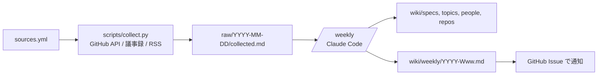

# a11y-llm-wiki

Web アクセシビリティの標準 (WCAG / ARIA / HTML / CSS の水平レビュー / ブラウザ・AT) と、GitHub 上のアクセシビリティ関連リポジトリの動きを毎週まとめ、LLM が育てる wiki。

[Jxck/tc39-llm-wiki](https://blog.jxck.io/entries/2026-06-29/tc39-llm-wiki.html) と Karpathy の [LLM-Wiki](https://gist.github.com/karpathy/442a6bf555914893e9891c11519de94f) を参考にしている。

- 最新の週次ダイジェスト: [`wiki/weekly/`](wiki/weekly/) (Issue ラベル `digest` でも配信)
- 目次: [`wiki/index.md`](wiki/index.md)

## 仕組み



毎週月曜 08:47 JST に GitHub Actions (`.github/workflows/weekly.yml`) が実行する。

1. `collect.py` が前回実行以降の差分を収集して `raw/` に保存し commit する (決定的処理、LLM 不使用)
2. `anthropics/claude-code-action` が `/weekly` を実行し、wiki を更新して週次ダイジェストを書く
3. ダイジェストを Issue として投稿する

## セットアップ

リポジトリの Settings → Secrets and variables → Actions に、次のどちらかを登録する。

- `CLAUDE_CODE_OAUTH_TOKEN` — Claude の Pro/Max プランで使う場合。手元で `claude setup-token` を実行して取得
- `ANTHROPIC_API_KEY` — API 従量課金で使う場合

未登録の場合は収集 (1) だけが動く。

初回は Actions → weekly → Run workflow で `since` に 2〜4 週間前の日付を入れて実行すると、最初のダイジェストに十分な材料が入る。

## コマンド (Claude Code で手動実行)

| コマンド | 用途 |
|---|---|
| `/weekly [raw/<date>]` | 収集結果から wiki 更新と週次ダイジェスト作成 |
| `/ingest <対象>` | 仕様・トピック・リポジトリの深掘り |
| `/lint` | 矛盾・古い記述・収集ソースの不具合を点検 |
| `/query <質問>` | wiki から回答し、価値があれば File back |

## ソースの追加

`sources.yml` を編集する。GitHub リポジトリ (ラベル / キーワード絞り込み可)、W3C 議事録のグループ名、RSS/Atom、リリース監視、GitHub 検索クエリ、awesome 系リストを定義できる。

ローカルで収集だけ試す:

```sh
pip install pyyaml
GITHUB_TOKEN=$(gh auth token) DRY_RUN=1 SINCE=2026-09-01 python scripts/collect.py
```
